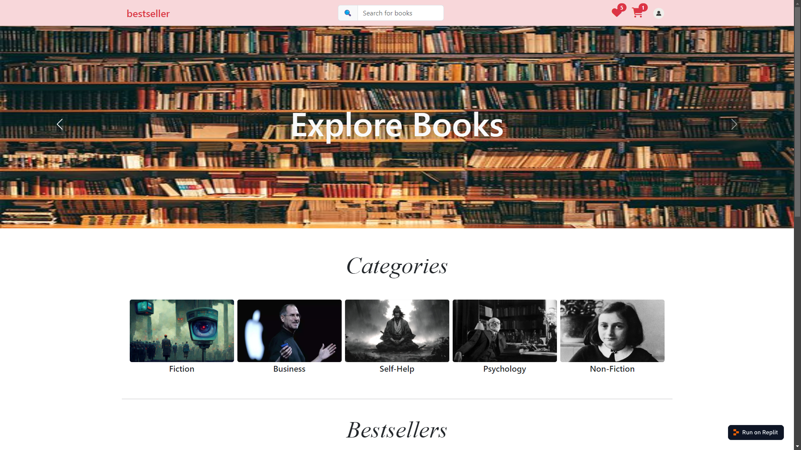
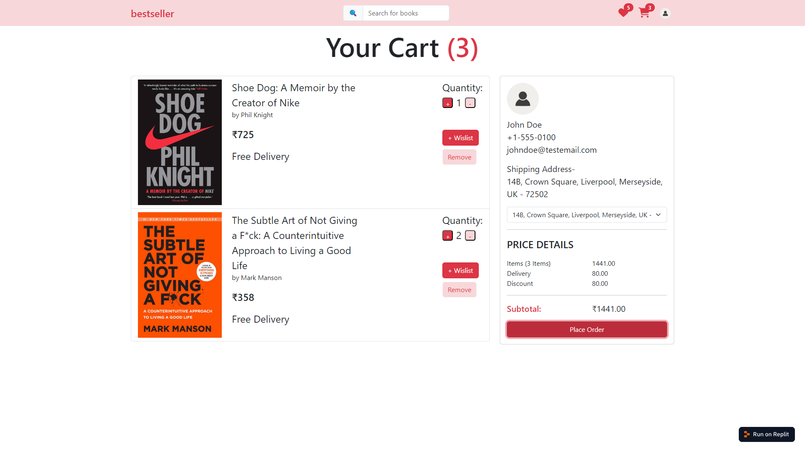

# 📚 Bookstore Full-Stack Web App

A responsive and dynamic bookstore application built using modern web technologies. This application allows users to browse, search, and purchase books, manage their shopping wishlist, cart, and handle user addresses. The app is powered by a **React + Redux** frontend and a **Node.js + Express.js** backend with **MongoDB** as the database.

---

## 🚀 Features

### Frontend:
- 📖 Browse and search for books.
- 🛒 Add and manage items in the shopping cart.
- 👤 User address details.
- 🎨 Fully responsive design for seamless use across devices.

### Backend:
- 📚 CRUD operations for books.
- ⚛️ Redux-persist to manage state across frontend.
- 📜 RESTful APIs for seamless client-server communication.
- 💾 Database integration with MongoDB using Mongoose.

---

## 🛠️ Tech Stack

### Frontend:
- **React.js**: For building the user interface.
- **React Router**: For client-side routing.
- **Redux**: For state management.
- **CSS/SCSS/Bootstrap**: For styling.

### Backend:
- **Node.js**: For server-side JavaScript runtime.
- **Express.js**: For building the REST API.
- **MongoDB**: For the database.
- **Mongoose**: For object modeling and schema management.

### Other Tools:
- **Axios**: For API requests.

---

## 🖼️ Screenshots

### Homepage


### Book Details


### Cart



---

## 🏗️ Installation and Setup

### Prerequisites
Make sure you have the following installed:
- Node.js (v16 or higher)
- MongoDB (running locally or cloud instance)

### Steps to Set Up

1. **Clone the Repository**
   ```bash
   git clone https://github.com/devMainak/bestseller-frontend.git
   cd bestseller-frontend/
